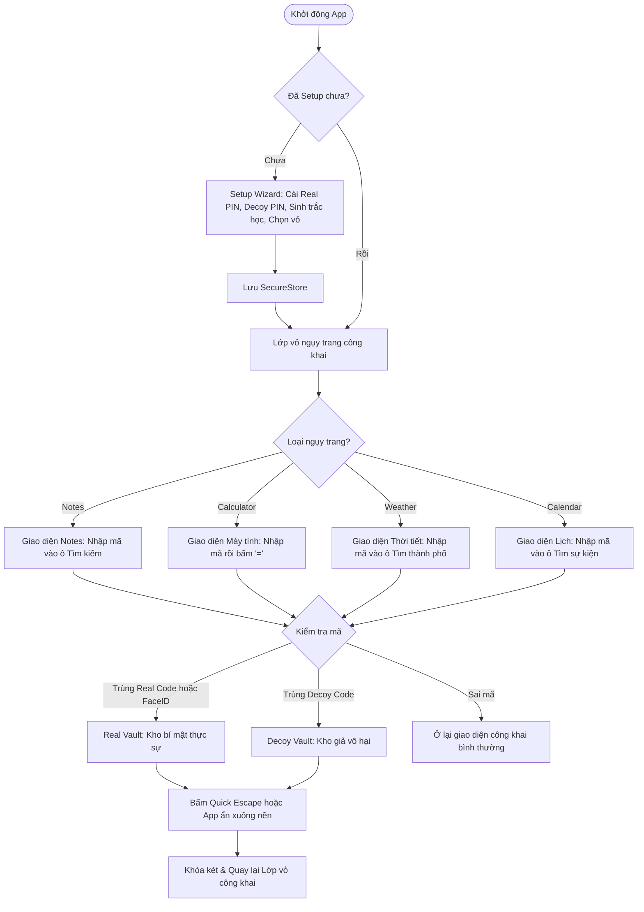

# Tổng quan Ứng dụng Hidder (Architecture & User Guide)

Ứng dụng **Hidder** là một ứng dụng di động **Stealth Vault** (Két sắt bảo mật ngụy trang) được phát triển theo định hướng **Local-First** kết hợp sao lưu tùy chọn qua **Cloud Sync (Supabase)**.

---

## 1. Mục đích & Triết lý cốt lõi

* **Ẩn danh tuyệt đối (Stealth Mode):** Ứng dụng khoác lên mình một vỏ bọc bình thường (Sổ ghi chú hoặc Máy tính cầm tay). Người ngoài khi cầm vào máy sẽ chỉ nghĩ đây là một ứng dụng tiện ích thông thường.
* **Bảo vệ dưới áp lực (Decoy / Duress Defense):** Cung cấp 2 mã PIN:
  * **Real Code (Mã thật):** Mở kho dữ liệu bí mật thực sự.
  * **Decoy Code (Mã mồi):** Mở một kho giả lập vô hại, dùng khi bị ép buộc phải mở ứng dụng.
* **Ưu tiên cục bộ (Local-First):** Dữ liệu được lưu trữ, mã hóa và xử lý trực tiếp trên thiết bị (hoạt động đầy đủ không cần Internet).
* **Tự động bảo vệ (Auto-defense):** Tự động khóa két ngay lập tức khi ứng dụng bị ẩn xuống chạy nền, chuyển app hoặc khóa màn hình.

---

## 2. Công nghệ & Thư viện sử dụng (Tech Stack)

| Phân hệ | Thư viện / Công nghệ | Phiên bản | Mục đích & Chức năng |
| :--- | :--- | :--- | :--- |
| **Core Framework** | **React Native** & **Expo** | `RN 0.81.5` / `Expo SDK 54` | Nền tảng xây dựng ứng dụng di động đa nền tảng |
| **Bảo mật phần cứng** | `expo-secure-store` | `~15.0.8` | Lưu trữ an toàn mã PIN thật, mã PIN giả vào Keychain (iOS) / Keystore (Android) |
| **Sinh trắc học** | `expo-local-authentication` | `~17.0.9` | Xác thực vân tay hoặc FaceID để mở khóa nhanh |
| **Lưu trữ CSDL cục bộ** | `@react-native-async-storage/async-storage` | `2.2.0` | Lưu trữ metadata, ghi chú public/private/decoy, danh sách mật khẩu, thẻ ngân hàng |
| **Hệ thống file Sandbox** | `expo-file-system` | `~19.0.24` | Quản lý kho tệp riêng tư cô lập (`hidder/photos/`, `videos/`, `documents/`, `audios/`) |
| **Chọn Media & Tệp tin** | `expo-image-picker`<br/>`expo-document-picker` | `~17.0.11`<br/>`~14.0.8` | Import ảnh, video từ thư viện máy và chọn tệp tài liệu (PDF, Word,...) đưa vào két |
| **Ghi âm & Âm thanh** | `expo-av` | `~16.0.8` | Ghi âm giọng nói bí mật và phát lại bản thu |
| **Tiện ích hệ thống** | `expo-clipboard`<br/>`expo-status-bar` | `~8.0.8`<br/>`~3.0.9` | Sao chép nhanh tài khoản / mật khẩu vào bộ nhớ tạm; tùy biến thanh trạng thái |
| **Backend & Cloud Sync** | `@supabase/supabase-js` | `^2.115.0` | Quản lý tài khoản (Supabase Auth) và đồng bộ sao lưu dữ liệu 2 chiều lên Supabase Cloud |

---

## 3. Cấu trúc thư mục dự án

```text
EXE2/
├── App.js                         # Điều phối điều hướng, state chính & các thao tác Vault
├── index.js                       # Điểm khởi chạy app
├── package.json                   # Danh sách dependencies & scripts
├── app.json                       # Cấu hình Expo
├── src/
│   ├── components/
│   │   └── SetupWizard.js         # Màn hình cấu hình lần đầu (PIN thật, PIN mồi, FaceID, Vỏ)
│   ├── context/
│   │   └── AuthContext.js         # Quản lý trạng thái khóa, xác thực PIN, Biometrics, Supabase Auth
│   ├── screens/
│   │   ├── public/                # Các màn hình ngụy trang công khai
│   │   │   ├── CalculatorScreen.js# Vỏ bọc Máy tính cầm tay
│   │   │   ├── NoteListScreen.js  # Vỏ bọc Danh sách ghi chú
│   │   │   ├── NoteDetailScreen.js# Chi tiết ghi chú công khai
│   │   │   ├── WeatherScreen.js   # Vỏ bọc Dự báo thời tiết
│   │   │   └── CalendarScreen.js  # Vỏ bọc Lịch & Sự kiện cá nhân
│   │   └── private/               # Các màn hình bên trong Két sắt
│   │       ├── VaultDashboardScreen.js # Bảng điều khiển trung tâm của Vault
│   │       ├── VaultNotesScreen.js     # Ghi chú bí mật
│   │       ├── PhotoVaultScreen.js     # Kho ảnh bảo mật
│   │       ├── VideoVaultScreen.js     # Kho video bảo mật
│   │       ├── PasswordVaultScreen.js  # Quản lý tài khoản đăng nhập & thẻ thanh toán
│   │       ├── DocumentVaultScreen.js  # Lưu trữ tệp tài liệu
│   │       ├── VoiceVaultScreen.js     # Bản ghi âm giọng nói
│   │       └── AccountScreen.js        # Đăng ký/đăng nhập & Đồng bộ đám mây Supabase
│   ├── services/
│   │   ├── crypto.js              # Chuẩn hóa và che giấu hiển thị mã PIN
│   │   ├── database.js            # Xử lý AsyncStorage & logic đẩy/kéo với Supabase
│   │   ├── fileSystem.js          # Tạo thư mục sandbox & sao chép file an toàn
│   │   ├── secureStorage.js       # Wrapper cho Expo SecureStore
│   │   └── supabase.js            # Khởi tạo Supabase client
│   └── utils/
│       └── helpers.js             # Hàm tiện ích (tạo UUID, format ngày tháng)
```

---

## 4. Luồng hoạt động chi tiết (Workflow)



### 4.1. Khởi tạo lần đầu (Setup Wizard)
* Người dùng không cần tạo tài khoản ngay.
* Thiết lập:
  1. **Mã thật (Real Code):** Tối thiểu 4 ký tự.
  2. **Mã mồi (Decoy Code):** Mã thay thế bắt buộc phải khác mã thật.
  3. **Sinh trắc học:** Tùy chọn kích hoạt FaceID/Vân tay (nếu thiết bị hỗ trợ).
  4. **Chọn vỏ ngụy trang ban đầu:** Ghi chú (*Notes*) hoặc Máy tính (*Calculator*).

### 4.2. Lớp vỏ ngụy trang (Public Disguise Shell)
* **Vỏ Ghi chú (Notes):** Hiển thị danh sách ghi chú công khai như một app Notes thông thường. Người dùng kích hoạt mở khóa bằng cách **gõ mã PIN vào thanh tìm kiếm**.
* **Vỏ Máy tính (Calculator):** Tính toán cộng, trừ, nhân, chia thật. Kích hoạt mở khóa bằng cách **bấm dãy số PIN rồi ấn dấu `=`**.

### 4.3. Hệ thống Két bảo mật (Vault Spaces)

#### A. Real Vault (Kho Thật)
Gồm 6 phân hệ quản lý dữ liệu an toàn:
1. **Private Notes:** Soạn thảo và lưu trữ các ghi chú nhạy cảm.
2. **Photo Vault:** Import ảnh từ thư viện vào thư mục sandbox cô lập của app.
3. **Video Vault:** Import và xem video riêng tư.
4. **Passwords & Cards:** Quản lý tài khoản (Username, Password) và thẻ tín dụng/ngân hàng (Số thẻ, Ngày hết hạn, CVV), hỗ trợ nút ẩn/hiện mật khẩu và copy nhanh vào clipboard.
5. **Document Vault:** Lưu trữ các loại tệp tài liệu văn bản, PDF, bảng tính,...
6. **Voice Memos:** Thu âm trực tiếp và bảo vệ các đoạn ghi âm âm thanh.
7. **Cloud Sync (Supabase):** Cho phép đăng ký/đăng nhập tài khoản Supabase để đồng bộ dữ liệu hai chiều lên đám mây.

#### B. Decoy Vault (Kho Mồi Đánh Lạc Hướng)
* Chỉ hiển thị các ghi chú mẫu an toàn, vô hại.
* Không hiển thị kho ảnh, video, tài liệu, mật khẩu hay tài khoản đám mây thật.
* Giúp bảo vệ dữ liệu tuyệt đối khi người dùng bị người khác ép mở máy.

### 4.4. Cơ chế phòng thủ khẩn cấp
* **Quick Escape:** Nút đỏ góc trên màn hình cho phép thoát tức thì ra ngoài vỏ bọc công khai.
* **Auto-Lock on Background:** Lắng nghe sự kiện `AppState`, tự động khóa và xóa quyền truy cập ngay khi người dùng thoát ra ngoài màn hình chính hoặc chuyển app khác.

### 4.5. Mô hình Freemium Cloud Storage (Google Drive / Dropbox Style)
* **Lưu trữ Cục bộ (Local Storage):** Hoàn toàn **MIỄN PHÍ TRỌN ĐỜI**, không có paywall, không giới hạn số lượng ảnh, video, tài liệu lưu trên máy.
* **Lưu trữ Đám mây (Cloud Storage):**
  * Tặng sẵn **256 MB miễn phí vĩnh viễn** cho mọi tài khoản vừa đăng ký.
  * Tính năng Cloud Sync là tùy chọn, chỉ kích hoạt khi người dùng muốn sao lưu.
  * Chỉ các file tải lên Cloud thành công (`sync_status = 'CLOUD'`) mới tính vào hạn mức Cloud Storage.
* **Các gói dung lượng Cloud:**
  * **Free:** 256 MB (0đ/tháng - Vĩnh viễn)
  * **Basic:** 500 MB (12.000đ/tháng)
  * **Standard:** 1.5 GB (32.000đ/tháng)
  * **Premium:** 5 GB (52.000đ/tháng)
* **Cơ chế Kiểm soát Hạn ngạch & Hết hạn (Quota & Downgrade Handling):**
  * Kiểm soát dung lượng Authoritative từ máy chủ (Server-side RPC `check_storage_quota`).
  * Khi gói trả phí hết hạn: Hệ thống tự động chuyển về gói Free 256 MB, **TUYỆT ĐỐI KHÔNG XÓA FILE CỦA NGƯỜI DÙNG**.
  * Nếu người dùng vượt quá dung lượng sau khi hạ gói: Vẫn có thể xem, tải và xóa các file Cloud cũ để giải phóng bộ nhớ, chỉ tạm thời chặn tải lên file mới cho đến khi có khoảng trống hoặc nâng cấp gói.

---

## 5. Hướng dẫn chạy ứng dụng

```bash
# 1. Cài đặt các gói phụ thuộc
npm install

# 2. Khởi chạy Metro Bundler
npx expo start

# 3. Chạy trên thiết bị
# - Quét mã QR bằng app Expo Go (Android) hoặc Camera (iOS)
# - Hoặc bấm phím 'a' cho Android emulator, 'i' cho iOS simulator, 'w' cho Web
```
